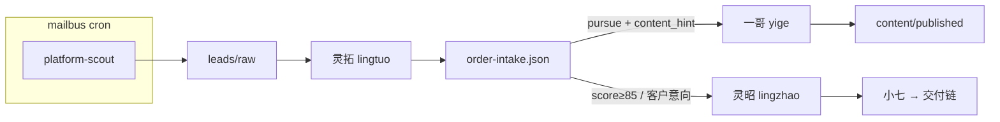

# 商前链路 + Agent 运行时选型 — 起草 v0.1

> 供审阅；确认后再写入 `config.json`、正式 identity、`role-flow-config.md`。

---

## 1. 文件清单（本次草稿）

| 文件 | 说明 |
|------|------|
| `store/config/leads-sources.example.json` | 采集源配置示例 |
| `store/config/order-intake.example.json` | intake 汇总示例（数组） |
| `store/rules/order-intake.schema.json` | JSON Schema |
| `identities/lingtuo.draft.md` | 灵拓 identity |
| `identities/yige-content-expansion.draft.md` | 一哥扩展要点 |

正式启用时建议：
- `leads-sources.example.json` → `store/config/leads-sources.json`
- `order-intake.example.json` → `store/leads/order-intake.json`（空数组 `[]` 起步）

---

## 2. 商前数据流



**原则**：爬虫是 **cron + Python/Playwright 脚本**，不是第五个 LLM agent 类型。

---

## 3. role-flow-config 拟增补（审阅用）

### 新增角色行

| 角色 | 职责 | 可执行人 | 默认 SLA |
|------|------|---------|---------|
| 市场拓展官 | 线索研判、intake、商机评分 | 灵拓(lingtuo) | 30 分钟 |
| 财务跟进官 | 开票提醒、回款节点、账期 | 灵账(lingzhang) | 15 分钟 |

### 新增 next_role 可选值

- `市场拓展官` — 有新 raw 线索需研判
- `财务跟进官` — 交付验收后进入回款跟踪
- `运营` — 需要内容获客/发布时（已有，一哥）

### 商前 → 交付衔接（非标准 pipeline step）

```
灵拓(decision=pursue) → 方案设计师（灵昭写 brief）
灵昭(brief done) → 调度员（小七拆工单，进入现有 chain）
一哥(content done) → 不强制 next_role；analytics 写回 intake tags 即可
验收(approved) → 财务跟进官（灵账建账期提醒）
```

---

## 4. Agent 运行时选型建议

### 4.1 现状（保持）

| type | 容器 | 角色 | 适用场景 |
|------|------|------|----------|
| `hermes_profile` | docker-agents-hermes-1 | 灵昭、灵瑾、灵犀、灵鉴、灵验、灵巡 | 结构化文档、调研、审查、pipeline 步骤 |
| `openclaw` | docker-agents-openclaw-1 | 小七、一哥 | 调度、运营、Gateway/渠道、长会话 |
| `cline` | docker-agents-lingxiao-1 | 灵霄 | 主开发、IDE 级改代码 |
| `opencode` | docker-agents-dali-1 | 大力 | 并行开发、第二实现路径 |

适配层已集中在 `lib/agent_adapters.py` —— **优先加 profile/角色，不加新 runtime**。

### 4.2 新角色映射（推荐）

| 新角色 | 推荐 runtime | 理由 |
|--------|--------------|------|
| **灵拓** lingtuo | `hermes_profile`（新 profile） | 与灵犀同类：读 JSON、写 schema、出报告；复用 Hermes 容器零增量 |
| **灵账** lingzhang | `hermes_profile`（新 profile） | Reminder/账期 JSON、模板化通知，无需 OpenClaw |
| **一哥（扩展）** | 保持 `openclaw` | 内容会话长、未来接发布渠道；已有 `OPENCLAW_STATE_DIR` 隔离 |
| **platform-scout** | **无 agent**（mailbus cron） | 定时脚本 + httpx/Playwright；结果落盘触发灵拓 |

### 4.3 是否需要「第五种 agent 架构」？

**结论：现阶段不需要。** 一人公司应控制运维面。

| 若遇到… | 建议 | 而非新容器类型 |
|---------|------|----------------|
| 反爬强的外包站 | Playwright 脚本 + cookie vault | ❌ 灵拓亲自爬 |
| 短视频成片 | 剪映 API / FFmpeg 模板 / 可灵等 API | ❌「视频 agent」容器 |
| 多 SaaS 串联（飞书+Notion+邮件） | n8n  sidecar 或 Python | ❌ 再套一层 AutoGPT |
| 7×24 客服 | OpenClaw Gateway 加 channel | ❌ 新 Hermes profile |
| 客户 sandbox 跑代码 | 云函数/临时容器 | ❌ 并入 Cline |

**何时才考虑新 runtime：**
1. OpenClaw 与 Hermes 都无法稳定 CLI push（适配层搞不定）且业务硬需求
2. 需要 **GPU 常驻**（本地大模型/视频）且与现有容器资源冲突 — 独立 **推理 worker**，仍不是 mailbus「角色 agent」
3. 合规要求 **物理隔离** 的客户数据环境 — 独立 Hermes profile 通常够用

### 4.4 模型/厂商层（与架构正交）

| 角色 | 模型倾向 | 说明 |
|------|----------|------|
| 灵拓 | deepseek-flash / 轻 reasoning | 批处理 intake，成本敏感 |
| 灵昭 brief | 现有配置 | 决策质量优先 |
| 一哥文案 | OpenClaw 上可调强创意模型 | 按条数计费，不必全角色升级 |
| 爬虫 | 无 LLM 或极小模型做 HTML 摘要 | 主逻辑 deterministic |

**不推荐**为每个新角色引入不同 Agent 框架（AutoGen、CrewAI、MetaGPT 等）—— 与 mailbus pipeline、ack、msg-results 契约重复建设。

---

## 5. config.json 拟增片段（审阅，未写入）

```json
"lingtuo": {
  "name": "灵拓",
  "role": "市场拓展",
  "type": "hermes_profile",
  "profile": "lingtuo",
  "models": ["deepseek-flash"],
  "inbox": "/mailbus/store/inbox/lingtuo/inbox.json",
  "profile_paths": {
    "identity": "/mailbus/identities/lingtuo.md",
    "skills_dirs": ["/mnt/e/hermes-data/.hermes/skills/"]
  },
  "launch": {
    "template": "hermes_dashboard",
    "browser": {
      "start_command": "hermes dashboard --port 9126 --profile lingtuo --host 0.0.0.0 --insecure",
      "dashboard_port": 9126
    },
    "cli": { "kind": "shell" }
  }
}
```

灵账 `lingzhang` 同理，port 9127。需在 Hermes 侧创建对应 profile 目录。

---

## 6. 待你确认的问题

1. **leads-sources** 首批启用：`v2ex` + `github_issues` 是否 OK？猪八戒类 Phase2？
2. **score 阈值**：85 自动通知灵昭、75 仅 pursue 标记 — 是否调整？
3. **灵账** 是否 Phase1 一并加 config，还是先 intake + 一哥扩展？
4. **order-intake** 单文件数组 vs 每单 `leads/intake/<id>.json` — 当前草案用 **单文件数组**（简单）；量大再拆。

---

## 7. 实施顺序建议（确认后）

1. 正式 identity + Hermes profile lingtuo
2. `leads-sources.json` + smoke scout（仅 v2ex）
3. 灵拓 mailbus 通知 handler + intake 校验脚本
4. 一哥 content 目录约定 + 读 intake 的 cron/通知
5. role-flow-config + VALID_ROLES 同步
6. 灵账与回款提醒（可滞后）
