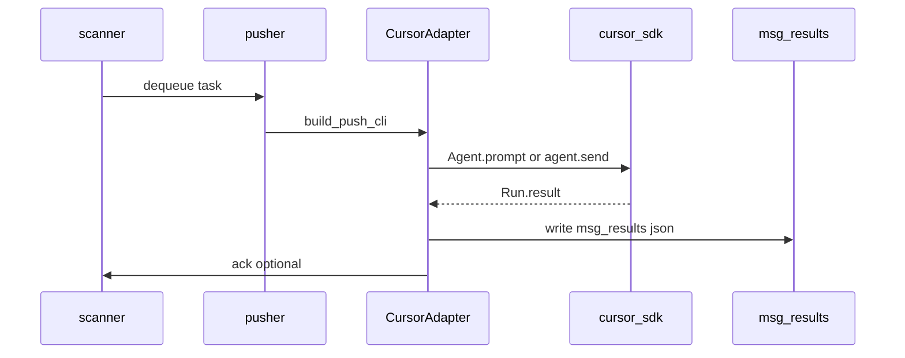

# Cursor Agent Mailbus 集成设计

> 状态：设计稿（Cursor SDK 未实现；Claude Code 见 [claude-code-adapter.md](./claude-code-adapter.md)）  
> 更新：2026-06-24

## 背景

当前 mailbus 通过 [agent_adapters.py](../lib/agent_adapters.py) 适配 Hermes / OpenClaw / OpenCode / Codex / Cline CLI。  
[model-routing.md](../rules/model-routing.md) 规定「编码重活用 **Cursor 直连**，mailbus 只管流转」——Cursor 不在 ADAPTERS 中。

本设计让 mailbus **可选** push 到 Cursor Agent（Cursor SDK），与 OpenCode/Codex 文件任务模式对齐，同时保留 IDE 内人工会话作为高复杂度编码通道。

## 目标与非目标

**目标**

- 新增 `type: cursor`，由 mailbus scanner/pusher 程序化触发 Cursor Agent
- 完成判定与现有 pipeline 一致：`msg-results/{msg_id}.json` 为 SoT
- 仅对显式 pro / cursor 运行时任务启用，避免与 flash 链路冲突

**非目标**

- 不替代 Cursor IDE 聊天窗口
- 不将 IDE 内 Agent 会话自动同步到 mailbus
- 本轮不实现代码

## 架构



## CursorAdapter 草案

```python
class CursorAdapter(BaseAdapter):
    type_name = "cursor"
    container_service = ""  # 宿主机/WSL 执行，非 Docker CLI
    mark_processing_on_task_push = True
    supports_auto_ack = False
```

**Push 实现（下轮）**

- 依赖：`cursor-sdk`（Python，`pip install cursor-sdk`）
- Local runtime：`Agent.prompt(msg, AgentOptions(api_key=..., model=..., local=LocalAgentOptions(cwd=push_cwd)))`
- Cloud runtime（可选）：`cloud=CloudAgentOptions(...)`，需 `CURSOR_API_KEY`
- 长任务：复用 [file_task_push.py](../lib/file_task_push.py) 写 `msg-files/{msg_id}.md`，prompt 指向文件路径

**与 IDE 关系**

| 入口 | 触发方 | 用途 |
|------|--------|------|
| Cursor IDE Agent | 人工 | 复杂编码、调试、review |
| mailbus → CursorAdapter | scanner | pro 任务、CI 式批量执行 |
| OpenCode (dali) | mailbus | 默认 flash 编码任务 |

mailbus push **≠** IDE 聊天；两者可并行，但不应假设状态共享。

## Config Schema

```json
{
  "agents": {
    "dali-cursor": {
      "name": "大力-Cursor",
      "type": "cursor",
      "models": ["composer-2.5"],
      "push": {
        "cwd": "/mnt/e/ai_tools",
        "runtime": "local"
      },
      "cursor": {
        "api_key_env": "CURSOR_API_KEY",
        "model": "composer-2.5",
        "cloud": false
      }
    }
  }
}
```

**路由 gate**（与 model-routing 一致）：

- `action.model_tier: "pro"` 且 `MAILBUS_ALLOW_PRO=1`
- 或 `action.agent_runtime: "cursor"`

## 文件协议（与现有 agent 一致）

| 路径 | 用途 |
|------|------|
| `store/inbox/{agent}/inbox.json` | 收件 |
| `store/inbox/{agent}/ack.json` | ack（必须） |
| `store/msg-files/{msg_id}.md` | 长任务工单 |
| `store/msg-results/{msg_id}.json` | **完成 SoT** |
| `store/replies/{sender}.json` | 可选通知，不参与 FSM |

`msg-results` 示例：

```json
{
  "agent": "dali-cursor",
  "msg_id": "msg-20260624-abc12",
  "status": "done",
  "summary": "已完成: 重构 module X",
  "timestamp": "2026-06-24T12:00:00+08:00"
}
```

## FSM 交互

1. scanner push → `pushed` / `processing`
2. CursorAdapter 执行 SDK run
3. 写 `msg-results` → `pipeline_trigger` / `task_fsm` 推进
4. `replies` 可选，**不**触发 done

复用 [task_completion.py](../lib/task_completion.py) 的 `is_task_complete()`。

## 安全边界

- API Key 仅从 env / `HERMES_SECRETS` 读取，不入 config 明文
- Local runtime `cwd` 限制在 team workspace（`/mnt/e/ai_tools`、`/mnt/e/hermes-data`）
- Cloud runtime 需显式 opt-in；默认 local
- 不执行 `Agent.prompt` 以外的 shell（与现有 CLI adapter 一致）

## 与大力 (OpenCode) 分工

| 场景 | 推荐 runtime |
|------|-------------|
| 日常 flash 编码 task | OpenCode (dali) |
| Pro 架构/refactor | CursorAdapter 或人工 IDE |
| Pipeline audit/review | Codex (lingxiao/lingjian) |
| 通知/调度 | Hermes / OpenClaw |

## 下轮实现清单

1. `CursorAdapter` + `ADAPTERS["cursor"]`
2. `pusher.py` 宿主机 subprocess 或 in-process SDK 调用（非 docker exec）
3. `config.example.json` + validate_agents
4. `tests/test_cursor_adapter.py`（mock SDK）
5. identities 文档 + AGENTS.md 交叉引用
6. Dashboard launch 可选入口

## 参考

- Cursor SDK Python: https://cursor.com/docs/sdk/python
- 现有 CodexAdapter: [agent_adapters.py](../lib/agent_adapters.py) `CodexAdapter`
- Pipeline 路径规范: [pipeline-agent-paths.md](../rules/pipeline-agent-paths.md)
- **Runtime Skill（设计 stub）**: [adapters/cursor/framework-runtime/SKILL.md](../adapters/cursor/framework-runtime/SKILL.md) — `status: not-implemented`，adapter 上线前 agent 勿调用 SDK
