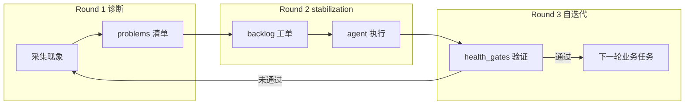

# mailbus 三轮迭代优化方案

> 生成时间：2026-06-16  
> 目标：基于**当前现象**整理问题，三轮递进优化；**每轮输出是下一轮的输入**，各 agent 可按 protocol 自行迭代执行。  
> 机器可读版本：`store/iterations/round-{1,2,3}-*.json`  
> Agent 操作手册：`store/rules/iteration-protocol.md`

---

## 当前现象总览（作为 Round1 输入素材）

| 现象 | 证据 | 影响 |
|------|------|------|
| Dashboard 任务几乎全部 `timeout` | `reminded_count=3`，创建后 ~15min 变 timeout | 审计 Tab 误判，无法区分真失败 |
| 追踪链曾显示 `?undefined` | pipeline chain 用 `to_person`，UI 读 `agent` | 已修 index.html，需刷新面板 |
| 审计负责人显示灵昭而非灵鉴 | `assignee`=当前执行人，非 `audit_reviewer` | 已修 UI + `audit_reviewer` 字段 |
| pipeline 任务卡在第一步 | `mailbus-hardening` step1=lingzhao running，无 msg-results | 全链不推进 |
| 灵昭 inbox 严重积压 | pending 50+，urgent 队列 450+ 条历史 reply | 新 task `pushed_count=0` |
| task_id ≠ msg_id | 任务 ID `mailbus-hardening-*`，消息 ID `msg-*` | tracker 无法同步 inbox 状态 |
| 催办 notice 被当成任务 | `remind-*` / `tracker-remind-*` 进 tracker | 噪音任务同样 timeout |
| notice 唤醒 agent | urgent 告警也 spawn Hermes | 加剧 inbox 积压与误追踪 |
| scan cron 曾丢失 | 工作流曾完全卡住 | 已用 install-mailbus-scan-cron 修复 |
| pipeline_trigger 曾未接入 | 设计有、scan 无调用 | 已接入 run_housekeeping |

**结论：** 基础设施（Docker/cron/pipeline 接入）已基本就绪；**当前瓶颈是「投递层」**：inbox 积压 + agent 未消费 + SLA 误杀。

---

## 三轮优化模型



---

## Round 1 — 现象整理 → 结构化问题清单

**输入：** 原始现象（上表 + scan/cron/inbox/tasks 实时数据）  
**输出：** `store/iterations/round-1-diagnosis.json`  
**执行者：** mailbus scan（自动，每轮刷新）或 `bus iteration --round 1`

### 1.1 问题分类（当前快照）

#### 🔴 Critical — 阻塞端到端流转

| ID | 问题 | 根因 | 证据 |
|----|------|------|------|
| C1 | pipeline 无 msg-results | assignee inbox 未消费 task | hardening step1 running，无 `msg-results/mailbus-hardening-*.json` |
| C2 | inbox 积压淹没新任务 | 串行队列 + 历史 reply/notice | lingzhao pending 50+，task pushed=0 |
| C3 | agent 未真正执行 | Hermes/daemon 未稳定消费 urgent 队列 | queue/urgent/lingzhao.json 450+ 条 |

#### 🟠 High — 误判与数据不一致

| ID | 问题 | 根因 | 证据 |
|----|------|------|------|
| H1 | 大量误 timeout | 5min×3 催办 + task_id/msg_id 不匹配 | false_timeout 列表非空 |
| H2 | 重复 tracker 噪音 | notice/remind 被 daemon 追踪 | remind-* 任务数百条 |
| H3 | 双任务条目 | API create + bus send 各建一条 | hardening 同时有 mailbus-hardening 与 msg-04794 |

#### 🟡 Medium — 体验与运维

| ID | 问题 | 根因 |
|----|------|------|
| M1 | Dashboard 审计 Tab 曾异常 | 前后端 chain 格式不一致（已修） |
| M2 | config max_concurrency 校验告警 | schema 未收录字段 |
| M3 | ES 日志查询未实现 | P1 方案在 inventory，未落地 |

### 1.2 Round1 验收标准

- [ ] `round-1-diagnosis.json` 存在且 `generated_at` 在 5 分钟内
- [ ] `problems[]` 每条含 severity / category / evidence
- [ ] `summary.critical` 数量与人工判断一致

**→ 作为 Round2 输入：** `problems[]` + `inbox_stats` + `task_stats`

---

## Round 2 — 问题清单 → 可执行工单（agent 分工）

**输入：** `round-1-diagnosis.json`  
**输出：** `store/iterations/round-2-backlog.json`  
**执行者：** `bus iteration --round 2`；灵昭确认后小七调度

### 2.1 工单列表（由引擎自动生成，示例如下）

| ID | 优先级 | Owner | 标题 | 验收 |
|----|--------|-------|------|------|
| R2-001 | P0 | xiaoqi | inbox 减负（lingzhao, …） | pending<50，hardening pushed>0 |
| R2-002 | P0 | lingzhao | 推进 mailbus-hardening | msg-results 存在，chain step+1 |
| R2-003 | P0 | lingxiao | 恢复误 timeout + 确认 config | false_timeout=0，reminder≥30 |
| R2-004 | P0 | lingzhao | 汇总 Round2 方案 | plan.md 引用全部 R2-id |
| R2-005 | P1 | lingjian | 审查 tracker/daemon 改动 | audit pass |
| R2-006 | P0 | lingyan | monitor-regression + snapshot | 9/9，pipeline 有进展 |

### 2.2 已落地代码修复（Round2 前置成果）

以下已在代码库中完成，Round2 验证即可：

| 模块 | 改动 |
|------|------|
| `lib/tracker.py` | task_id↔msg 关联、skip 噪音、reopen_stale_timeouts |
| `lib/scanner.py` | config 驱动催办间隔、Round1 自动诊断 |
| `store/config.json` | reminder_minutes=30, max_reminders=12 |
| `mailbox-daemon.py` | notice 不唤醒、仅 task 类型 tracker |
| `docs/index.html` | 审计 Tab chain/灵鉴显示 |
| `lib/iteration_engine.py` | 三轮 JSON 生成 |

### 2.3 Round2 验收标准

- [ ] 至少 1 条 P0 pipeline 任务产生 `msg-results/*.json`
- [ ] scan 日志出现 `[pipeline] xxx 完成 ->`
- [ ] `round-2-backlog.json` 中 P0 项 `status=done`
- [ ] lingzhao inbox pending < 50

**→ 作为 Round3 输入：** backlog 完成度 + 回归结果

---

## Round 3 — 工单结果 → 自迭代闭环协议

**输入：** `round-2-backlog.json`（完成度）+ 回归脚本结果  
**输出：** `store/iterations/round-3-protocol.json`  
**执行者：** `bus iteration --round 3`；小七在 P0 全绿后触发

### 3.1 自迭代循环（每 15 分钟 / 每轮 scan）

| 步骤 | Actor | 动作 | 输出 |
|------|-------|------|------|
| 1 | mailbus scan | housekeeping + pipeline + **Round1 诊断** | round-1-diagnosis.json |
| 2 | 灵昭 | critical>0 → 确认/更新 Round2 工单 | round-2-backlog.json |
| 3 | 各 owner | 读 inbox task → 执行 → msg-results | iteration-r2-NNN.json |
| 4 | 灵验 | monitor-regression + snapshot | iteration-r3-verify.json |
| 5 | 小七 | health_gates 判定 → 新一轮或继续 R2 | protocol 更新 |

### 3.2 健康门禁（进入下一轮业务任务前）

**必须全部满足：**
1. `lingzhao.inbox.pending` < 50  
2. `task_stats.false_timeout` 为空  
3. 至少 1 个 pipeline `chain` step ≥ 2  

**任一触发则告警并回到 Round1：**
- cron.log 连续 3 次 traceback  
- 全部 agent 的 task 消息 60min 无 pushed  

### 3.3 Round3 验收标准

- [ ] `round-3-protocol.json` 中 `backlog_status.pending` = 0（P0）
- [ ] health_gates 全部通过
- [ ] 可自动发起 `iteration-{date}-r1` 新任务而不人工干预

**→ 作为下一轮 Round1 输入：** 新一轮业务 task（如 hardening 完成后 → game-lvup E2E）

---

## 一键执行

```bash
# WSL / 容器内
cd /mnt/e/ai_tools/mail
python3 -m bus iteration --round all --data-dir store

# 或
bash /mnt/e/ai_tools/docker-agents/run-mailbus-iteration.sh all dispatch
```

下发后 agent 读取顺序：
1. `store/rules/iteration-protocol.md`
2. `store/iterations/round-1-diagnosis.json`
3. `store/iterations/round-2-backlog.json`

---

## 与现有任务的关系

| 任务 ID | 在三轮中的位置 |
|---------|----------------|
| `mailbus-hardening-20260616` | Round2 核心验收用例（pipeline 模板 A） |
| `game-lvup-*` | Round3 通过后作为 Round1 下一轮输入 |
| `remind-*` / `tracker-remind-*` | Round1 标记为噪音，不参与业务健康度 |

---

## 附录：现象 → 问题 → 工单 映射表

| 现象 | Round1 ID | Round2 动作 |
|------|-----------|-------------|
| 全 timeout | H1 | R2-003 reopen + config |
| 追踪链 undefined | M1 | 已修 UI，lingyan 回归 |
| 审计显示灵昭 | M1 | 已修 audit_reviewer |
| pipeline 不推进 | C1 | R2-002 灵昭写 msg-results |
| inbox 积压 | C2/C3 | R2-001 小七减负 |
| agent 不迭代 | — | Round3 protocol + scan 自动 R1 |
